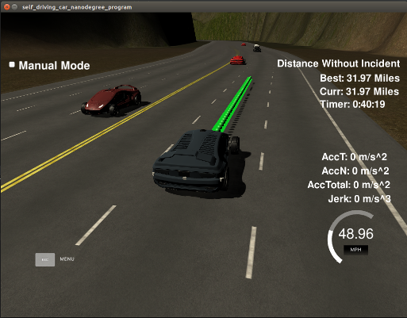

# CarND-Path-Planning-Project
   
The goal of this project is to implement a path planning algorithm to guide a car in a highway simulator. The path 
planning algorithm must provide a trajectory that the car will follow in the simulator safely and comfortably, i.e. with
reasonable values for acceleration and jerk.

The path planning algorithm implemented in this project consists of the following main modules:
* Prediction: receives information from sensors and predicts where the neighbor cars are going to be located in
the track.
* Behavioral Planner: decides what action the car should take. Actions in this context could be "change lane" or "keep 
lane and reduce speed" for example.
* Trajectory Generator: this module is responsible for creating the trajectory the car must follow once the Behavioral
Planner module has decided what action to take. The Trajectory Generator module must create a path that is smooth, 
avoiding uncomfortable acceleration or jerk.

## Path Planning Algorithm Steps
The Path Planning algorithm starts when it receives a message from the simulator with the current car position, sensor 
fusion data and the previous path the car was following. The simulator expects lists with the next x and y coordinates 
of the car in return. The simulator moves the car to the next (x,y) point every 20ms. The path planning algorithm steps
are as follows:
1) The Prediction module receives the sensor fusion data from the neighbor cars, including position (x,y) and Frenet
(s,d) coordinates. It also receives the current velocity vx and vy of each neighbor car within sensor range. The prediction
module uses this sensor fusion data to estimate where the neighbor cars are going to be located in the next second, 
assuming that they would continue on the same lane with the same velocity.
2) The Behavioral Planner module is called to decide which trajectory the car should follow. It receives the predicted
neighbor cars positions and the current car position. It computes the cost of keeping the same lane or changing to an
adjacent lane. The cost function in the Behavioral Planner module is a weighted function of the (i) the estimated 
trajectory speed and (ii) changing lanes. 
3) Once the Behavioral Planner module decides which action to take it calls the Trajectory Generator module to generate
the (x,y) coordinates of the trajectory. The implementation of the trajectory generator uses the spline implementation
by Tino Kluge to generate a smooth trajectory without violating Acceleration and Jerk constraints.

## Code Structure
I refactored the template code from Udacity and created new classes to implement each module. The code contains the 
following classes and structures:
* BehavioralPlanner: implements the Behavioral Planner module outlined above. 
* Car: structure that encapsulates the data from the car in the simulator.
* main: entry point for the program. The main method instantiates the PathPlanner object and receives data from the 
simulator, creating Car and NeighborCars objects and sending them to the PathPlanner instance for computing the 
trajectory.
* Map: refactored map from the Udacity's template code. Contains mainly methods to convert between Frenet and 
XY global map coordinates.
* NeighborCars: encapsulates data about each neighbor car received from the sensor fusion module.
* Path: structure that contains a trajectory path consisting of (X,Y) coordinates. Optionally contains path end Frenet 
 coordinates.
* PathPlanner: Path Planning algorithm entry point.
* Predictor: Predictor module, estimates the neighbor car positions as described in the previous section.
* SpeedEstimation: estimates the car acceleration and speed given a distance to the closest neighbor car.
* spline: Spline algorithm implementation.
* TrajectoryGenerator: Trajectory Generator module, uses the estimated speed and acceleration from the Behavioral Planner
module to generate a valid trajectory. 

## Conclusion and Reflection
 The Path Planning algorithm implemented in this project generates valid trajectories for driving in a highway with
 traffic using Udacity's simulator. More specifically it passes all criteria from the project rubric for valid 
 trajectories:
* Car is able to drive at least 4.32 miles without incident: I tested for ~ 40 miles without any incident.
* The car drives according to the speed limit: It drives at most at 49mph, while the road limit is 50mph.
* Max acceleration and jerk are not exceeded: The Trajectory Generator and Speed Estimation modules compute the  
acceleration for each trajectory so that it does not violate the max acceleration. The Trajectory Generator module also 
creates a trajectory that avoids Jerk violations, using spline to create smooth trajectories.
* Car does not have collisions: the Behavioral Planner implementation takes a safe distance into account  when computing 
the cost for each potential trajectory, avoiding collisions.
* The car stays in its lane, except for the time between changing lanes: the car changes lanes efficiently and stays at
the center of the lane when it is not changing lanes.
* The car is able to change lanes: the Behavioral Planner module cost function takes the speed into account, so the car
changes lanes when there is a trajectory with speed closer to the target speed of 49mph.

Further improvements to the algorithm could use a more advanced Behavioral Planning algorithm that reduces the speed 
temporarily so that it could reach another lane where it could achieve a speed closer to the target of 50mph for a 
longer period.

 
